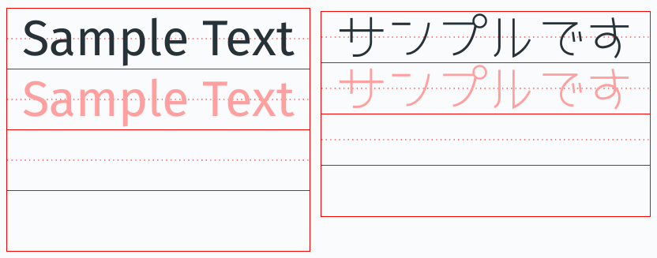

# Handwriting Practice Generator

Generate handwriting practice sheets.

Provide the text to practice, (optionally) specify the font, then print the rendered HTML using your favorite browser.

## Requirements

Uses [Pollen](https://pollenpub.com/).

1. Edit `index.html.pm` to your liking
2. `raco pollen start`
3. Open `localhost:8080/index.html`
4. Print the page

## Function

### `word-practice` (`sample-text`, `grid?` = `#f`, `font` = `#f`)

Generate a practice sheet for `sample-text` with four slots:

- Reference
- Greyed out (to be written over)
- Empty with line going through it
- Empty

If `grid?` is `#t`, use a grid instead of a line. Note that this is not lined up with the characters, and so is kind of useless.

If `font` is not `#t`, it is used as the font family for the sample text.
